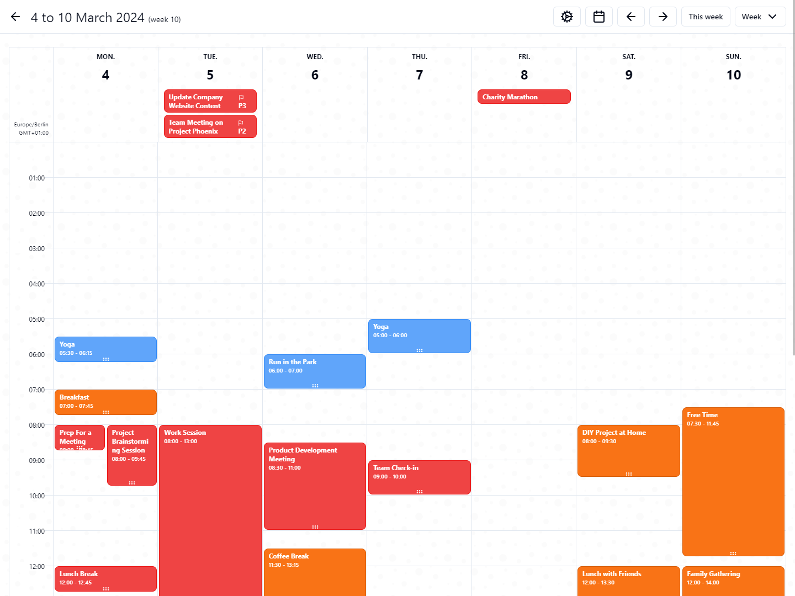

# MoaiTime

MoaiTime is a self-hosted productivity app that helps you organize your life, work and more. It is designed to be simple, fast and easy to use, while also being powerful and feature-rich. It is also open-source, so you can host it yourself, modify it to your liking and contribute to it.

## Screenshots

And much more! You can find more screenshots on my blog post [https://bobalazek.com/blog/0003-moaitime/](https://bobalazek.com/blog/0003-moaitime/).

## Features

- **Calendar**, where you can add your events, appointments and more. Additionally you also have the ability to subscribe to other external calendars
- **Tasks**, where you can add lists, tasks, assign colours, priorities, durations, due dates, tags, hierarchy and more
- **Habits**, so you can easily add your own daily, weekly, monthly and yearly habits. Again, you can set the colour, order, goal and at the moment we also have a couple dozen templates to choose from. You also have the ability to see your streaks
- **Notes**, with a simple what you see is what you get editor
- **Mood tracking**, to track your mood, with some additional information like the emotions you are experiencing and a note
- **Focus**, which is at the moment basically just a pomodoro timer, where you specify the thing you want to work on, the durations for the focus and periods and the number of repetitions
- **Social**, which is basically a simple social network type of thing, where you can follow, be followed, see achievements, find other users and post things. Still figuring out the last part on what the best way to implement that will be
- **Statistics**, to have a quick overview of the number of entries we have for each feature
- **Notifications**, that you get if you get achievements
- **Command palette**, to get to things faster
- **Settings**, where you set your profile, invite users, privacy, per-feature settings and much more
- Misc
  - **Dark mode**, so your eyes won’t get hurt
  - **Widgets**, like a clock (analogue and digital), greetings, quotes, backgrounds, weather (soon!) and more
  - **Teams**, where you can create teams, invite users to them and are able to share calendars, tasks and notes with them. Oh, and you can also nudge them on to work on tasks
  - **Real-time communication**, so changes are instantly reflected on all your, and your team’s devices
  - **Keyboard shortcuts**, to save even more time
  - **Search**, including setting your preferred search engine
  - **Responsive design**, so you can use it on any device (native apps coming soon!)
  - **Accessibility**, so everyone can use it
  - **Data exports**, so you can take your data with you

## Stack

- General: [TypeScript](https://www.typescriptlang.org)
- Tooling: [Turborepo](https://turbo.build/repo), [pnpm](https://pnpm.io), [Vite](https://vitejs.dev), [tsup](https://tsup.egoist.sh), [ESLint](https://eslint.org), [Prettier](https://prettier.io), [Husky](https://typicode.github.io/husky)
- Frontend: [React](https://reactjs.org), [Zustand](https://zustand.surge.sh), [Jotai](https://jotai.org), [Zod](https://zod.dev), [React Router](https://reactrouter.com/en/main), [TailwindCSS](https://tailwindcss.com), [Shadcn UI](https://ui.shadcn.com)
- Backend: [NestJS](https://nestjs.com), [Drizzle ORM](https://orm.drizzle.team), [BullMQ](https://docs.bullmq.io)
- Mobile: [Capacitor](https://capacitorjs.com)
- Testing: [Cypress](https://www.cypress.io), [Vitest](https://vitest.dev)
- Databases: [PostgreSQL](https://www.postgresql.org), [Redis](https://redis.io)
- Storage: [MinIO](https://min.io)
- CI/CD: [Docker](https://www.docker.com), [Kubernetes](https://kubernetes.io), [GitHub Actions](https://github.com/features/actions), [Portainer](https://www.portainer.io)
- Mailer: [Nodemailer](https://nodemailer.com), [Resend](https://resend.com)

## Installation

Right now, we support the following ways to install MoaiTime:

- [Docker Compose](./docs/DEPLOY-TO-DOCKER-COMPOSE.md)
- [Docker Swarm](./docs/DEPLOY-TO-DOCKER-SWARM.md)
- [Kubernetes](./docs/DEPLOY-TO-KUBERNETES.md)

## Documentation

- [Development](./docs/DEVELOPMENT.md)
- [Commands](./docs/COMMANDS.md)
- [Testing](./docs/TESTING.md)

## TODOs

- [ ] Improve the documentation
- [ ] Add more unit, integration and E2E tests

## License

MoaiTime is licensed under the MIT license.
